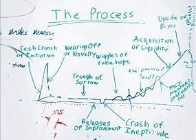

I didn't really enjoy our three months at [Y Combinator](http://ycombinator.com/).

Let me clarify: none of that was YC's fault --- quite the opposite. They made the time bearable.
I don't doubt for a second that joining YC in Summer 2010 was the right choice for us. But our
experience of YC was different from the experience that many YC startups get.

The difference? We had [already launched](http://blog.rapportive.com/the-accidental-launch).

You'd think that hey, it's fantastic to have launched, particularly as successfully as we did!
Well, yes, but the downside is that we spent the entire 3 months of YC (and probably another
month either side) doing the following:

* Answering many, many support emails and tweets
* Raising [our seed round](http://techcrunch.com/2010/08/02/rapportive-funding/)
* Stopping our infrastructure from collapsing under our user growth
* Responding to press and bloggers
* Reading resumés and interviewing job candidates
* Fixing gnarly bugs in production
* Applying for visas, so that we could work in the US
* Attending YC dinners and office hours

By contrast, the ideal world of Y Combinator involves spending 3 months:

* Moving your product forward
* Attending YC dinners and office hours

Although all the things we were doing were valuable --- even spending so much time on support
is valuable, because we learnt a lot about our users, and we turned lots of people from angry
strangers into enthusiastic supporters --- it was incredibly frustrating. Our product development
was almost stalled for months on end. And all the while, our YC batchmates were demoing new
features every week, and getting a massive high from the productive flow of developing their
products at a rapid pace.

So I am perhaps a bit envious of those who could move ahead rapidly and build their product
without having to worry about supporting users or keeping their database alive. On the other
hand, I am of course hugely grateful for our users who use and
[love our product](http://rapportive.com/buzz) every day. I wouldn't have it any other way.

  

Fortunately, we are not the first to experience this. At the YC office there is a whiteboard,
now carrying somewhat iconic status, which reminds every single YC founder of *"The Process"*:
once a startup has launched, the novelty will wear off, and the team will find itself in the
*"Trough of Sorrow"*. We know what the Trough of Sorrow looks like. I have just described it.
It's not very much fun.

But here is good news: Rapportive now seems to have journeyed on to the next phase, we have made
[*"Releases of Improvement"*](http://blog.rapportive.com/grow-your-network-with-rapportive),
and things are looking hopeful. Are we in those *"Wiggles of False Hope"*? Who knows. But hey,
the money is in the bank, the visas are in our passports, the infrastructure has got a lot more
robust, and most importantly, our product development is moving again. We have some really cool
stuff coming soon. The hope is real. And we seem to have managed to avoid the
*"Crash of Ineptitude"*.

So what have we learnt?

* Visibly iterating and improving the product is arguably the most important thing a startup
  should be doing, but sadly, other stuff has an uncanny ability to distract you away from
  product work. [Paul Graham has written](http://www.paulgraham.com/top.html) about money matters
  and disputes being particularly bad in this regard. That is true, and I would add server
  firefighting, recruitment and immigration to the list.

* In order get back into a flow of product development, we are now deliberately shunning
  distractions like recruitment and fundraising. We obviously can't ignore these things forever,
  but for now it's best for the business if we stay focussed on the thing we do best: making a
  [product that people want](http://www.paulgraham.com/good.html). (We're keeping one distraction,
  namely support, because it is so important. But we are rotating support duties so that most of
  the team can ignore it at any given moment.)

* Be grateful if you carry a US passport.

* Sometimes you just have to wade through a patch of mud, and there's no way round it. But as
  long as you keep your eyes forward and keep moving, you'll get through it, and things will
  brighten up.

  

